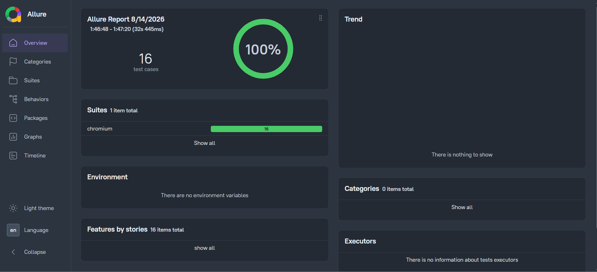
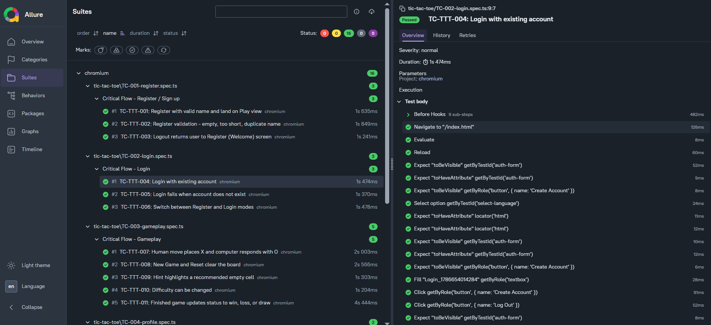

# Huma E2E Automation Framework Created By Muhammad Arsalan

Playwright + TypeScript end-to-end automation for the **Tic-Tac-Toe** web application.

This framework covers **critical functional flows** using the **Page Object Model (POM)**, with **Allure reporting** and **GitHub Actions CI/CD**.

The application under test is local (`index.html`). Playwright starts it automatically via `webServer` — no staging/production deploy is required.

## Proof of Testing (POT)

Recorded execution of the critical Tic-Tac-Toe Playwright suite:

[Watch the POT recording](./docs/pot/Tic-tac-toe-execution-pot.mp4)

<video src="./docs/pot/Tic-tac-toe-execution-pot.mp4" controls width="720">
  Your browser does not support embedded video. Use the link above.
</video>

## Execution Report-01



## Execution Report-02



---

## Table of contents

1. [Prerequisites](#1-prerequisites)
2. [First-time setup](#2-first-time-setup)
3. [Application under test](#3-application-under-test)
4. [Framework structure](#4-framework-structure)
5. [POM mapping (page → spec)](#5-pom-mapping-page--spec)
6. [How to run tests](#6-how-to-run-tests)
7. [Allure reporting](#7-allure-reporting)
8. [GitHub Actions CI/CD](#8-github-actions-cicd)
9. [Test isolation](#9-test-isolation)
10. [Configuration notes](#10-configuration-notes)
11. [Troubleshooting](#11-troubleshooting)
12. [Proof of Testing (POT)](#proof-of-testing-pot)
13. [Execution Report-01](#execution-report-01)
14. [Execution Report-02](#execution-report-02)
15. [Test plan](./docs/TEST-PLAN.md)
16. [Test cases](./docs/TEST-CASES.md)
17. [Approach](./docs/APPROACH.md) (optional)

---

## 1. Prerequisites

Install these before running tests:

| Dependency | Version / notes | Why needed |
|---|---|---|
| **Node.js** | LTS (18+ recommended) | Runs npm + Playwright |
| **npm** | Comes with Node.js | Installs packages |
| **Google Chrome** (local only) | Latest | Local TicTacToe project uses Chrome channel |
| **Java Runtime (JRE 8+)** | Optional but recommended for Allure CLI | `allure generate` / `allure open` |

Check versions:

```bash
node -v
npm -v
```

---

## 2. First-time setup

From the repository root:

```bash
# 1) Install npm packages
npm install

# 2) Install Playwright browsers (Chromium is enough for CI / assignment suite)
npx playwright install chromium

# Optional (local headed Chrome runs):
npx playwright install chrome
```

No filled `.env` values are required for the Tic-Tac-Toe suite (auth is name-only and stored in browser `localStorage`).

An example file is included as `.env.example` (keys only, empty values) for reviewer reference:

```bash
# optional
copy .env.example .env   # Windows
# cp .env.example .env   # macOS / Linux
```

---

## 3. Application under test

| Item | Detail |
|---|---|
| App file | `index.html` (root) |
| How it starts | Playwright `webServer` runs `npx http-server . -p 3000` |
| Base URL | `http://127.0.0.1:3000` |
| Entry page | `http://127.0.0.1:3000/index.html` |

You do **not** need to start the server manually when using npm test scripts. Playwright starts/stops it.

Manual check (optional):

```bash
npx http-server . -p 3000 -c-1
# open http://127.0.0.1:3000/index.html
```

---

## 4. Framework structure

```text
Huma_E2E_Automation_Framework/
├── index.html                      # Tic-Tac-Toe app (local AUT)
├── playwright.config.ts            # Projects, webServer, reporters, baseURL
├── package.json                    # npm scripts (test + Allure)
├── tsconfig.json                   # TypeScript config
├── pages/                          # Page Object Model classes
│   ├── RegisterPage.ts
│   ├── LoginPage.ts
│   ├── GamePage.ts
│   ├── ProfilePage.ts
│   ├── HistoryPage.ts
│   ├── SettingsPage.ts
│   └── NavigationPage.ts           # Play / Profile / History / Log Out
├── Fixtures/
│   └── constants.ts                # Shared expected messages
├── tests/
│   └── tic-tac-toe/
│       ├── test-base.ts            # Shared Playwright fixtures (POM wiring)
│       ├── TC-001-register.spec.ts
│       ├── TC-002-login.spec.ts
│       ├── TC-003-gameplay.spec.ts
│       ├── TC-004-profile.spec.ts
│       ├── TC-005-history.spec.ts
│       ├── TC-006-settings.spec.ts
│       └── TC-007-session-nav.spec.ts
├── docs/
│   ├── TEST-PLAN.md                # Short test plan (required)
│   ├── TEST-CASES.md               # Concrete cases (required)
│   ├── APPROACH.md                 # Why this approach (optional)
│   ├── pot/
│   │   └── Tic-tac-toe-execution-pot.mp4  # Proof of Testing recording
│   └── reports/
│       ├── Execution-Report-01.png
│       └── Execution-Report-02.png
└── .github/workflows/
    └── playwright.yml              # CI: run tests + publish Allure
```

### Design highlights

- **POM**: UI actions live in `pages/*`; specs stay readable.
- **`test-base.ts`**: extends Playwright `test` with page objects + `registerFreshUser` helper.
- **Locators**: mix of `getByRole` (user-facing) and `getByTestId` (stable attributes like `data-status` / board cells).
- **Isolation**: each test starts with clean storage (no shared login session file for Tic-Tac-Toe).

---

## 5. POM mapping (page → spec)

| Page Object | Spec file | Purpose |
|---|---|---|
| `RegisterPage` | `TC-001-register.spec.ts` | Create account / validation / logout back to welcome |
| `LoginPage` | `TC-002-login.spec.ts` | Login success/failure + mode switch |
| `GamePage` | `TC-003-gameplay.spec.ts` | Moves, AI response, hint, difficulty, game end |
| `ProfilePage` | `TC-004-profile.spec.ts` | Stats, rename, delete account |
| `HistoryPage` | `TC-005-history.spec.ts` | Empty history + history after finished game |
| `SettingsPage` | `TC-006-settings.spec.ts` | Theme + language |
| `NavigationPage` | `TC-007-session-nav.spec.ts` | Play / Profile / History + session after reload |

Navigation is also used inside the other specs (logout, profile, history) so those flows stay end-to-end.

---

## 6. How to run tests

### Recommended (assignment suite — Chromium/Chrome)

```bash
# Headless Chromium/Chrome (default)
npm test
# or
npm run test:ttt
```

### Cross-browser (same local app works on all browsers)

The app is served on `http://127.0.0.1:3000` — it is **not** Chrome-only. Reviewers can also run Firefox:

```bash
# Install Firefox browser binary once
npx playwright install firefox

# Chrome / Chromium only
npm run test:ttt:chrome

# Firefox only
npm run test:ttt:firefox

# Both browsers
npm run test:ttt:browsers
```

> Note: running both browsers doubles execution time and opens more workers. Default scripts use Chromium only to keep runs light.

### Useful variants

```bash
# Headed browser (parallel workers — multiple windows)
npm run test:ttt:headed

# Headed demo / review mode (1 browser window, serial)
npm run test:ttt:headed:serial

# Playwright UI mode
npm run test:ttt:ui

# Step-by-step debug
npm run test:ttt:debug

# Run one file
npx playwright test tests/tic-tac-toe/TC-001-register.spec.ts --project=chromium
```

### npm scripts reference

| Script | What it does |
|---|---|
| `npm test` / `npm run test:ttt` | Run TicTacToe project |
| `npm run test:ttt:headed` | Same suite, headed (parallel) |
| `npm run test:ttt:headed:serial` | Headed demo with 1 worker (single browser) |
| `npm run test:ttt:ui` | Playwright UI runner |
| `npm run test:ttt:debug` | Debug mode |
| `npm run report:playwright` | Open Playwright HTML report |
| `npm run allure:generate` | Build Allure HTML from `allure-results` |
| `npm run allure:open` | Open Allure HTML report |
| `npm run allure:report` | Generate + open Allure |
| `npm run test:report` | Run tests, then generate + open Allure |

---

## 7. Allure reporting

Allure is already wired in `playwright.config.ts` via the `allure-playwright` reporter.

### Local flow

```bash
# 1) Run tests (cleans old allure-results first, then writes fresh results)
npm run test:ttt

# 2) Generate HTML report into ./allure-report
npm run allure:generate

# 3) Open report in browser
npm run allure:open
```

One command:

```bash
npm run test:report
```

> Important: Allure **accumulates** old runs in `allure-results/`.  
> Our npm test scripts call `clean:allure` first so the report shows only the latest run.  
> `allure generate --clean` only clears `allure-report/` (output), not previous result files.  
> If you still see Safari/WebKit/old counts, run `npm run clean:allure`, then `npm run test:report`.

### Requirements for Allure CLI

- Package `allure-commandline` is already in `devDependencies`.
- If `allure` command fails, install a JRE (Java 8+) and retry:

```bash
java -version
npm run allure:generate
```

### Output folders

| Folder | Contents |
|---|---|
| `allure-results/` | Raw Allure results (gitignored) |
| `allure-report/` | Generated HTML report (gitignored) |
| `playwright-report/` | Playwright HTML report (gitignored) |
| `test-results/` | Traces / screenshots / videos on failure (gitignored) |

---

## 8. GitHub Actions CI/CD

Workflow file: `.github/workflows/playwright.yml`

### What CI does

1. Checkout code  
2. Setup Node.js (LTS)  
3. `npm ci`  
4. Install Playwright Chromium  
5. Run `npm run test:ttt`  
6. Upload Playwright + Allure artifacts  
7. Generate Allure HTML  
8. Deploy Allure report to **GitHub Pages** (on `main` / `master`)

### Triggers

- Push to `main` / `master`
- Pull requests to `main` / `master`
- Manual run (`workflow_dispatch`)

### Reviewer notes

- CI runs **only** the `TicTacToe` project (assignment suite).
- No external secrets are required for Tic-Tac-Toe tests.
- After merge to main/master, enable **GitHub Pages** (Settings → Pages → source: `gh-pages` branch) to view the published Allure site.

Artifacts are also downloadable from the Actions run page:
- `playwright-report`
- `allure-results`
- `allure-report`

---

## 9. Test isolation

Each Tic-Tac-Toe spec starts with empty storage (`storageState` cookies/origins cleared in `test-base.ts`). There is no shared login file and no global setup/teardown.

You do not need to reset the app between runs. `registerFreshUser()` creates a unique name per test.

---

## 10. Configuration notes

Key file: `playwright.config.ts`

- **`webServer`**: serves `index.html` on port `3000`
- **`baseURL`**: `http://127.0.0.1:3000`
- **Reporters**: list + Allure + Playwright HTML
- **Project `chromium`**: matches `tests/tic-tac-toe/*.spec.ts`
- **CI browser**: Playwright Chromium (no system Chrome dependency)
- **Local browser**: system Chrome channel when available

---

## 11. Troubleshooting

### `Executable doesn't exist` / browser missing

```bash
npx playwright install chromium
# or for local Chrome channel:
npx playwright install chrome
```

### Port 3000 already in use

Stop the existing process on port 3000, or let Playwright reuse it locally (`reuseExistingServer` is enabled when not in CI).

### Allure command not found / generate fails

1. Ensure dependencies installed: `npm install`
2. Ensure Java is available: `java -version`
3. Re-run: `npm run allure:generate`

### Tests fail only after language switch to Persian

Role/name locators are English-oriented. Specs set language back to English where needed. Prefer `data-testid` for language-sensitive assertions.

### Windows file casing (`LoginPage.ts`)

Keep the filename as `LoginPage.ts` (PascalCase). Avoid renaming to `loginPage.ts` on Windows — casing conflicts can break imports.

---

## Quick start (reviewer checklist)

```bash
git clone <repo-url>
cd Huma_E2E_Automation_Framework
npm install
npx playwright install chromium
npm run test:ttt
npm run allure:report
```

Expected: Tic-Tac-Toe critical flows pass, Allure report opens locally.
